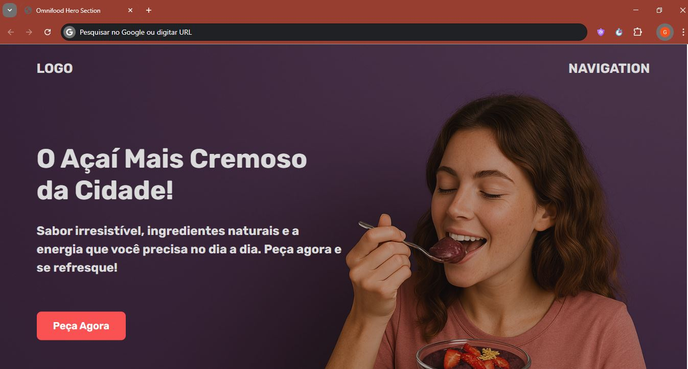

# 🍓 Hero Section - Loja de Açaí  

Este repositório contém a **Hero Section** de uma loja fictícia de açaí, desenvolvida com **HTML e CSS**. O design é moderno, responsivo e focado em boas práticas de desenvolvimento web.  

## 🚀 Tecnologias  

- **HTML5** - Estrutura semântica  
- **CSS3** - Estilização responsiva  

## 🎨 Preview  

  

## 📚 Créditos  

Este projeto foi inspirado nos estudos realizados no curso **"HTML & CSS Course – Build Responsive Real-World Websites"** de [Jonas Schmedtmann](https://www.udemy.com/course/design-and-develop-a-killer-website-with-html5-and-css3/).  

## ⚠️ Uso  

Este projeto foi desenvolvido apenas para fins de estudo e **não deve ser modificado ou redistribuído**.  

## 📜 Licença  

Este projeto está protegido por direitos autorais e **não possui licença para modificação ou redistribuição**.  

---

Se precisar de mais ajustes, só avisar! 🚀🔥  

